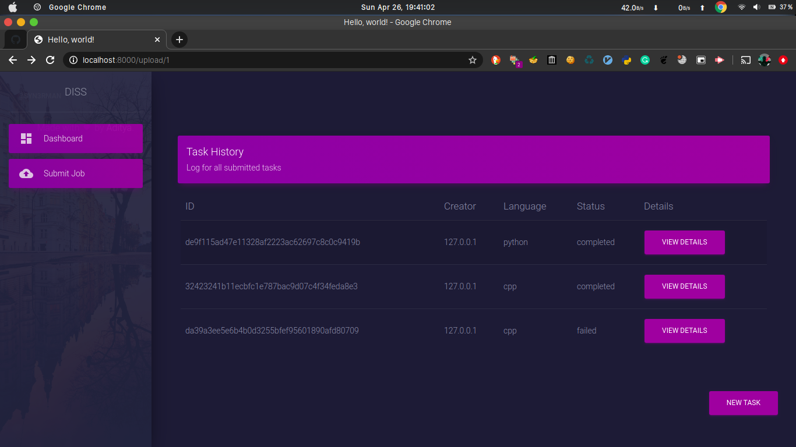
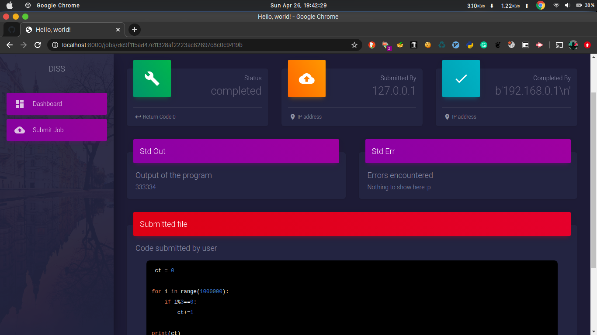

<h1 align = "center">Diss</h3>
<h3 align="center">DIstributed Submission System</h3>

<div align="center">


[](https://www.python.org/)
[](https://www.rabbitmq.com/)
<br>


</div>

------------------------------------------

> Leverages the distributed nature of RabbitMQ to allow users to submit their code to a master that distributes work to workers. It offloads the responsibility of fault tolerance, distribution and scalabililty to RabbitMQ.

------------------------------------------

<br>

<div align="center">
    <h3>Architecture/Event flow<h3>
</div>


The project uses the RabbitMQ broker as a messaging queue to store the task generated by the clients, which is shared among wokers.

The clients send the job they want to submit to an exchange, which sends it to an appropriate queue based on the binding key.

<div align="center">
    <h3>Client<h3>
</div>

The client can submit new tasks or view tasks previously submitted. Screenshots:


<div align="center"><h5> Dashhboard </h5></div>




<div align="center"><h5> View submitted tasks </h5></div>


<div align="center"><h5> Create new task </h5></div>



<div align="center"><h5> View details of task</h5></div>

#### Using API endpoints

```
POST /upload/<page_num>: Get details for the submitted tasks

POST /jobs/<job_id>: Get info about a specific task
```

<div align="center">
    <h3>Future work<h3>
</div>

- [ ] Add charts on dashboard
- [ ] Add pagination in frontend
- [ ] Add support for more languages
- [ ] Safe execution of code
- [ ] Add option for batch file upload
- [ ] Notify users when task is completed
- [ ] Multiple views for different users
- [ ] Add logging


<div align="center">
    <h3>Running the project locally<h3>
</div>

Setup the RabbitMQ server:
#### Using docker

```
docker run -it --rm --name rabbitmq -p 5672:5672 -p 15672:15672 rabbitmq:3.8
```

Run the flask server for the client using 
```
python3 client/app.py
```

Running the worker nodes:

```
$ cd workers/

$ docker-compose up --scale python=2 --scale cpp=3
```


<div align="center"><h5> Scaling the services using docker-compose</h5></div>


Since the project only supports pymongo and uses mongo atlas to store data, you need to define an .env file (in the folders client/, workers/python/ and workers/cpp/) with the following two parameters:

```
RABBITMQ_SERVER: host running the rabbitMQ broker

MONGO_URL: Where the data is to be stored.
```